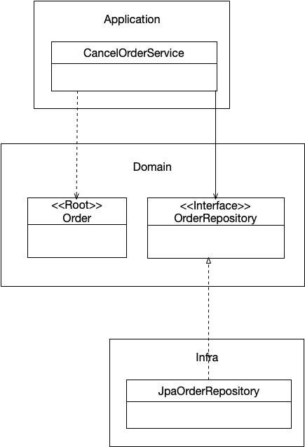

# 도메인 영역의 주요 구성요소

- Entity : `고유 식별자`를 갖는 객체, 자신의 라이프사이클을 가진다. 주문(Order), 회원(Member), 상품(product)과 같이 `도메인의 고유한 개념을 표현`한다. `도메인 모델의 데이터를 포함`하며 해당 데이터와 관련된 기능을 함께 제공한다.
- Value : 고유 식별자를 갖지 않는 객체, 주로 `개념적으로` 하나의 도메인 객체의 속성을 표현할 때 사용. 주소(Address)나 금액(Money)과 같은 타입. Entity의 속성뿐만 아니라 Value의 속성으로도 사용될 수 있다.
- Aggregate : Entity와 Value 객체를 개념적으로 하나로 묶은 것. Order 엔티티, OrderLine 밸류, Orderer 밸류 객체를 '주문' 애그리거트로 묶을 수 있다.
- Repository : 도메인 모델의 영속성을 처리. DBMS 테이블에서 엔티티 객체를 로딩하거나 저장
- Domain Service : 특정 엔티티에 속하지 않은 도메인 로직을 제공한다. '할인 금액 계산'은 상품, 쿠폰, 회원 등급, 구매 금액 등 다양한 조건을 이용해서 구현하게 되는데, 이렇게 도메인 로직이 여러 엔티티와 밸류를 필요로 할 경우 도메인 서비스에서 로직을 구현한다.


도메인 모델의 엔티티는 단순히 데이터를 담고 있는 데이터 구조가 아니라 `데이터와 함께 기능을 제공하는 객체`이다.

### 애그리거트

도메인이 커질수록 개발할 도메인 모델도 커지면서 많은 엔티티와 밸류가 출현한다. 엔티티와 밸류 개수가 많아지면 많아질수록 모델은 점점 더 복잡해진다.

도메인 모델이 복잡해지면 전체 구조가 아닌 하나의 엔티티와 밸류에만 집중하게 된다. 이렇게 개별 요소에만 초점을 맞추다 보면 `큰 수준에서 모델을 이해하지 못해`서 큰 틀에서 모델을 관리할 수 없다.

- 관련된 객체를 애그리거트로 묶는다. 객체를 군집 단위로 모델을 바라본다.
- 애그리거트는 군집에 속한 객체들을 관리하는 `루트 엔티티`를 갖는다.(관리, 지휘 역할)
- 애그리거트를 사용하는 코드는 애그리거트 루트를 통해서 간접적으로 애그리거트 내의 다른 에티티나 밸류 객체에 접근하게 된다.
- 이것은 애그리거트의 내부구현을 숨겨서 애그리거트 단위로 구현을 `캡슐화`할 수 있도록 돕는다.

> 구현은 3장에서 다룬다.

### 리포지터리

애그리거트 단위로 도메인 객체를 저장하고 조회하는 기능을 정의한다.

주문 애그리거트를 위한 Repository
```java
public interface OrderRepository {
    public Order findByNumber(OrderNumber number);
    public void save(Order order);
    public void delete(Order order);
}
```

애그리거트 루트는 Order인것을 알 수 있다.



리포지터리 인터페이스는 도메인 모델 영역에 속하며, 실제 구현 클래스는 인프라스트럭처 영역에 속한다.

- Configuration 클래스를 따로 뺀다.

```java
@Configuration
public class OrderServiceConfig {
    @Autowired
    private OrderRepository orderRepository;
    
    @Bean
    public CancelOrderService cancelOrderService() {
        return new CancelOrderService(orderRepository);
    }
}

@Configuration
public class ReposigtoryConfig {
    @Bean
    public JpaOrderRepository orderRepository() {
        return new JpaOrderRepository();
    }
    
    @Bean
    public LocalContainerEntityManagerFactoryBean emf() {
        ...
    }
}
```

### 요청 처리 흐름

`브라우저 <-> Controller <-> Service <-> Domain Object <-> Repository`


### 인프라스트럭처 

DIP에서 공부한 것 처럼 도메인 영역과 응용 영역에서 인프라스트럭처의 기능을 직접 사용하는 것보다 이 두 영역에 정의한 인터페이스를 인프라스트럭처 영역에서 구현하는 것이 시스템을 더 유연하고 테스트하기 쉽게 만들어준다.

하지만, 무조건 인프라스트럭처에 대한 의존을 없애는 것이 좋은 것은 아니다. `DIP의 장점을 해치지 않는 범위에서 Application과 Domain layer에서 구현 기술에 대한 의존을 가져가는 것이 현명하다.`

- 스프링의 @Transaction은 굉장이 편하다..!


### 모듈 구성

도메인이 복잡해 질수록 모듈 나누는것이 중요하다. 

- com.myshop.order.domain.order : 애그리거트 위치
- com.myshop.order.domain.service : 도메인 서비스 위치

- com.myshop.catalog.application.product
- com.myshop.catalog.application.category

모듈 구조를 얼마나 세분화해야 하는지에 대한 정해진 규칙은 없음. 단지 한 패키지에 너무 많은 타입이 몰려서 코드를 찾을 때 불편한 정도만 아니면 된다.

> 패키지 구분의 기준이 갯순데 다른 좋은 기준도 있을듯?
Domain, service 패키지를 따로 두는것 보다 같은 도메인끼리 같은 패키지에 두는것도 요즘 좋은듯